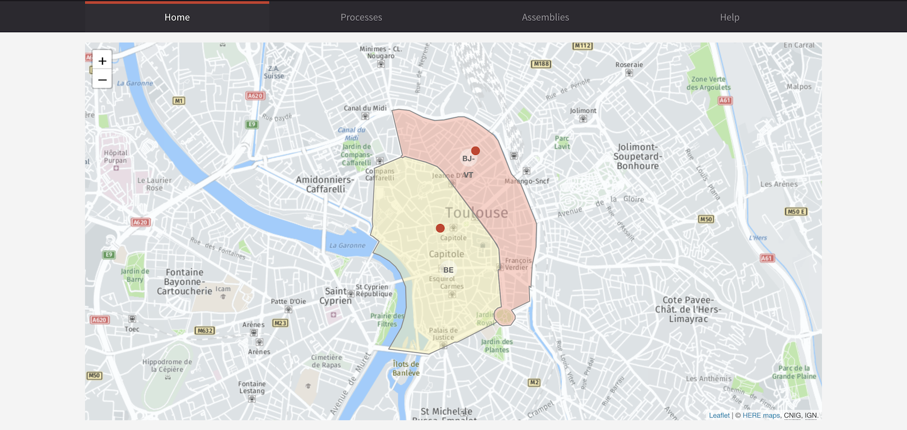
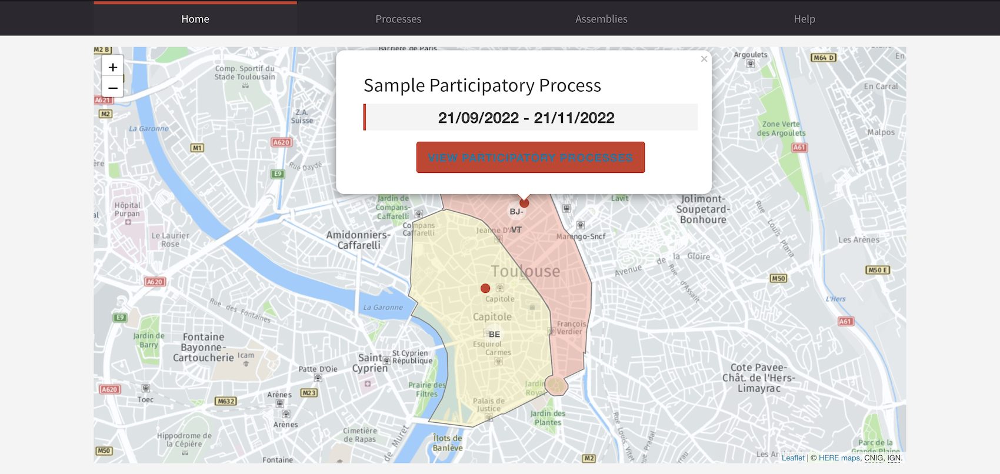

# Homepage Interactive Map

Add a new map interactive in your homepage content blocks. This module display the assemblies linked to a Participatory Process on a map, based on given GeoJSON.

## Screenshots

* Example of simple interactive map


* Example of PP in interactive map


## Usage

To configure a working interactive map in your Decidim application, you must define before : 

* `MAPS_API_KEY` env var
* Uncomment the maps section in decidim initializer `development_app/config/initializers/decidim.rb:38`
* Define : 
  * Assemblies with scope
  * Scope with GeoJSON content
  * PP with linked assemblies enabled (geocoding address for PP is not required)

**Seeds should create expected resources see [seeds file](./db/module_seeds.rb)**

## Installation

Add this line to your application's Gemfile:

```ruby
gem "decidim-homepage_interactive_map", git: "https://github.com/OpenSourcePolitics/decidim-module-homepage_interactive_map.git"
```

And then execute:

```bash
bundle
bundle exec rake decidim_homepage_interactive_map:install:migrations
bundle exec rake db:migrate
bundle exec rake decidim_homepage_interactive_map:webpacker:install
```

* On OSX:
```bash
brew install proj
bundle config build.rgeo-proj4 --with-proj-dir="/opt/homebrew"
bundle install
```

In Decidim's backoffice, enable Interactive map content block.

## How it works

1. The content block will first ensure map api key is defined.
2. Ensure linked assemblies are present
3. Load a leaflet map inside the content block
4. Fetch assemblies and scopes 
5. Apply GeoJSON as zone layer
6. Define markers for each assemblies
7. Load participatory process
   * If PP has location, places the marker at the defined address
   * Otherwise, place the participatory process on the top right corner of assemblie marker (like a notification badge)


## Contributing

See [Decidim](https://github.com/decidim/decidim).

## License

This engine is distributed under the GNU AFFERO GENERAL PUBLIC LICENSE.
